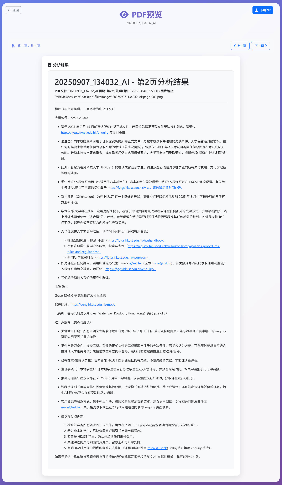

# 写在前面

我发现对于我们非英语母语者，阅读一份充斥着专业名词的全英文讲义是非常困难的。使用一些翻译软件逐句翻译太慢了，而且时常翻译了后面忘了前面。截图给 AI，让 AI 帮忙解释，需要一页一页的截图，效率太低了，而且回溯起来非常低效。于是，我写一个简单的程序自动化整个过程。但是最近，我发现我的室友也存在着一样的困扰，于是便丰富了前端，制作了这个项目，使得非计算机相关专业的同学也可以享受 AI 时代的便利，进而提高学习效率。

# PDF 智能分析助手

一个基于 AI 的 PDF 文档智能分析工具，可以将 PDF 文件转换为图片，并使用大语言模型对每页内容进行详细分析，生成结构化的分析报告。

## 📸 项目截图

### 主页面

<div align="center">
  
  <p><em>主页面展示：文件上传、API 配置、文件管理等功能</em></p>
</div>

### 预览界面

<div align="center">
  
  <p><em>预览界面展示：分析结果浏览、页面导航等功能</em></p>
</div>

## ✨ 主要功能

### 核心功能

- **PDF 文件上传** - 支持拖拽上传，最大 50MB
- **智能分析** - 使用 AI 模型分析 PDF 每页内容
- **实时进度** - 显示处理进度，支持随时取消
- **文件管理** - 查看、下载、删除已处理的文件

### 新增功能

- **ZIP 下载** - 下载所有页面的分析结果为 ZIP 压缩文件
- **预览功能** - 全新的预览界面，浏览 PDF 每一页的分析结果
- **任务取消** - 可以在处理过程中随时终止任务
- **文件删除** - 可以删除不需要的 PDF 文件及其所有相关文件

## 🚀 快速开始

### 环境要求

- Python 3.8+
- Node.js 16+ (可选，用于前端开发)

### 安装步骤

1. **克隆项目**

   ```bash
   git clone <repository-url>
   cd ReviewAssistant
   ```

2. **安装 Python 依赖**

   ```bash
   cd backend
   pip install -r requirements.txt
   ```

3. **安装系统依赖**

   **Windows:**

   - 下载并安装 [Poppler for Windows](https://github.com/oschwartz10612/poppler-windows/releases/)

   **Ubuntu/Debian:**

   ```bash
   sudo apt-get install poppler-utils
   ```

   **macOS:**

   ```bash
   brew install poppler
   ```

### 启动方式

#### 方式一：一键启动（推荐）

```bash
# 同时启动前端和后端
python start_all.py
```

#### 方式二：分别启动

```bash
# 启动后端服务
python start_backend.py

# 启动前端服务（新终端窗口）
python start_frontend.py
```

#### 方式三：Windows 批处理文件

```bash
# 双击运行
start_all.bat        # 启动所有服务
start_backend.bat    # 仅启动后端
start_frontend.bat   # 仅启动前端
```

#### 方式四：手动启动

```bash
# 启动后端
cd backend
python run.py

# 启动前端（新终端）
cd frontend
python -m http.server 8080
```

### 访问应用

- **前端地址**: http://localhost:8080
- **后端 API**: http://localhost:5000

启动成功后，您将看到如上图所示的主页面界面，可以开始使用所有功能。

## 📖 使用指南

### 1. 配置 API

在主页面顶部的 API 配置区域：

- 填写 API Key 和 API Base URL
- 选择使用的 AI 模型
- 自定义系统提示词
- 点击"保存配置"和"测试连接"

### 2. 上传 PDF 文件

在文件上传区域：

- 拖拽 PDF 文件到上传区域
- 或点击选择文件按钮
- 支持最大 50MB 的 PDF 文件
- 可以自定义分析提示词

### 3. 开始分析

- 点击"上传并开始分析"按钮
- 系统会自动转换 PDF 为图片
- 使用 AI 模型分析每页内容
- 实时查看处理进度

### 4. 查看结果

在文件管理区域：

- 查看所有已处理的文件列表
- 点击"预览"按钮浏览分析结果（如上图预览界面所示）
- 点击"下载"按钮下载 ZIP 文件
- 点击"删除"按钮删除不需要的文件

## 🔧 配置说明

### API 配置

在应用界面中配置以下参数：

- **API Key**: 您的 OpenAI API 密钥
- **API Base URL**: API 服务地址（默认：https://api.openai.com/v1）
- **模型名称**: 使用的模型（默认：gpt-4.1-2025-04-14）
- **系统提示词**: 自定义分析提示词

### 环境变量

也可以通过环境变量配置：

```bash
export ZETATECHS_API_KEY="your-api-key"
export ZETATECHS_API_BASE="https://api.openai.com/v1"
```

## 📁 项目结构

```
ReviewAssistant/
├── backend/                 # 后端API服务
│   ├── app.py              # Flask主应用
│   ├── run.py              # 后端启动脚本
│   ├── requirements.txt    # Python依赖
│   ├── config.json         # 配置文件
│   ├── core/               # 核心模块
│   │   ├── config_manager.py    # 配置管理
│   │   ├── file_manager.py      # 文件管理
│   │   └── pdf_processor.py     # PDF处理
│   └── files/              # 文件存储
│       ├── uploads/        # 原始PDF文件
│       ├── images/         # 转换的图片
│       └── explanations/   # 分析结果
├── frontend/               # 前端界面
│   ├── index.html          # 主页面
│   ├── preview.html        # 预览页面
│   └── js/
│       └── app.js          # 前端逻辑
├── start_all.py            # 一键启动脚本
├── start_backend.py        # 后端启动脚本
├── start_frontend.py       # 前端启动脚本
└── README.md               # 项目说明
```

## 🛠️ 技术栈

### 后端

- **Flask** - Web 框架
- **pdf2image** - PDF 转图片
- **OpenAI** - AI 模型接口
- **Werkzeug** - 文件上传处理
- **zipfile** - ZIP 文件生成

### 前端

- **HTML5** - 页面结构
- **Bootstrap 5** - UI 框架
- **JavaScript ES6** - 交互逻辑
- **Font Awesome** - 图标库
- **Marked.js** - Markdown 渲染

## 📋 功能详解

### 主页面功能

主页面集成了所有核心功能，包括：

- **API 配置区域**: 配置 AI 模型参数和系统提示词
- **文件上传区域**: 支持拖拽上传 PDF 文件，最大 50MB
- **文件管理区域**: 查看、预览、下载、删除已处理的文件
- **任务管理区域**: 显示处理进度和任务状态

<div align="center">
  
</div>

### 预览功能

预览界面提供专门的分析结果浏览体验：

- **功能描述**: 提供全新的预览界面，浏览 PDF 每一页的分析结果
- **界面特性**:
  - 单列布局，居中显示分析结果内容
  - 页面导航：上一页/下一页按钮
  - 键盘导航：支持左右箭头键切换页面
  - 响应式设计：支持不同屏幕尺寸
  - 优化阅读：大字体、合适的行间距

<div align="center">
  
</div>

### ZIP 下载功能

- **功能描述**: 下载 PDF 文件的所有分析结果为 ZIP 压缩文件
- **包含内容**: 所有页面的 Markdown 格式分析结果
- **文件结构**:
  ```
  {PDF名称}_explanations.zip
  ├── {PDF名称}_explanations/      # 分析结果目录
  │   ├── page_001.md              # 第1页分析结果
  │   ├── page_002.md              # 第2页分析结果
  │   └── ...
  └── {PDF名称}_README.txt         # 说明文件
  ```

### 任务管理

- **实时进度**: 显示处理进度和状态信息
- **任务取消**: 可以随时取消正在处理的任务
- **文件删除**: 删除 PDF 文件及其所有相关文件
- **状态跟踪**: 实时更新任务状态和错误信息

## 🔒 安全说明

- API 密钥仅存储在本地，不会上传到服务器
- 所有文件处理都在本地进行
- 支持删除功能，保护用户隐私
- 支持任务取消，避免资源浪费

## 🎯 使用场景

1. **学术研究** - 分析学术论文、研究报告
2. **文档审查** - 快速理解复杂的技术文档
3. **内容提取** - 从 PDF 中提取结构化信息
4. **教育培训** - 将 PDF 教材转换为可交互的学习材料
5. **法律文档** - 分析合同、法规等法律文件

## 🐛 故障排除

### 常见问题

1. **PDF 转换失败**

   - 检查 Poppler 是否正确安装
   - 确认 PDF 文件没有密码保护
   - 检查文件大小是否超过 50MB

2. **API 连接失败**

   - 检查 API Key 是否正确
   - 确认网络连接正常
   - 验证 API Base URL 格式

3. **预览页面无法打开**

   - 检查浏览器是否阻止了弹出窗口
   - 确认 PDF 文件已完成分析处理
   - 刷新页面重试

4. **下载功能异常**
   - 检查文件是否已完成分析
   - 确认有足够的磁盘空间
   - 查看浏览器控制台错误信息

### 调试模式

- 打开浏览器开发者工具查看控制台日志
- 检查后端日志输出
- 验证 API 响应数据格式

## 📝 更新日志

### v2.0.0 (最新版本)

- ✅ 添加 ZIP 下载功能（仅包含解释文档）
- ✅ 添加预览功能（仅显示解释内容）
- ✅ 优化用户界面和交互体验
- ✅ 简化加载逻辑，提升性能
- ✅ 完善错误处理和用户反馈

### v1.0.0

- ✅ 基础 PDF 分析功能
- ✅ 文件上传和管理
- ✅ 实时进度显示
- ✅ 取消处理功能
- ✅ 文件删除功能
- ✅ 结果导出功能

## 🤝 贡献指南

欢迎提交 Issue 和 Pull Request 来改进项目。

### 开发环境设置

1. Fork 项目到您的 GitHub 账户
2. 克隆您的 Fork 到本地
3. 创建新的功能分支
4. 提交您的更改
5. 推送到您的分支
6. 创建 Pull Request

### 代码规范

- 使用 Python PEP 8 代码风格
- 使用 JavaScript ES6+ 语法
- 添加适当的注释和文档
- 编写清晰的提交信息

## 📄 许可证

本项目采用 MIT 许可证。详情请参阅 [LICENSE](LICENSE) 文件。

## 📞 支持

如有问题，请通过以下方式获取帮助：

1. 查看本文档的故障排除部分
2. 在 GitHub 上提交 Issue
3. 联系项目维护者

## 🙏 致谢

感谢所有为这个项目做出贡献的开发者和用户！

---

**PDF 智能分析助手** - 让 PDF 文档分析变得简单高效！
